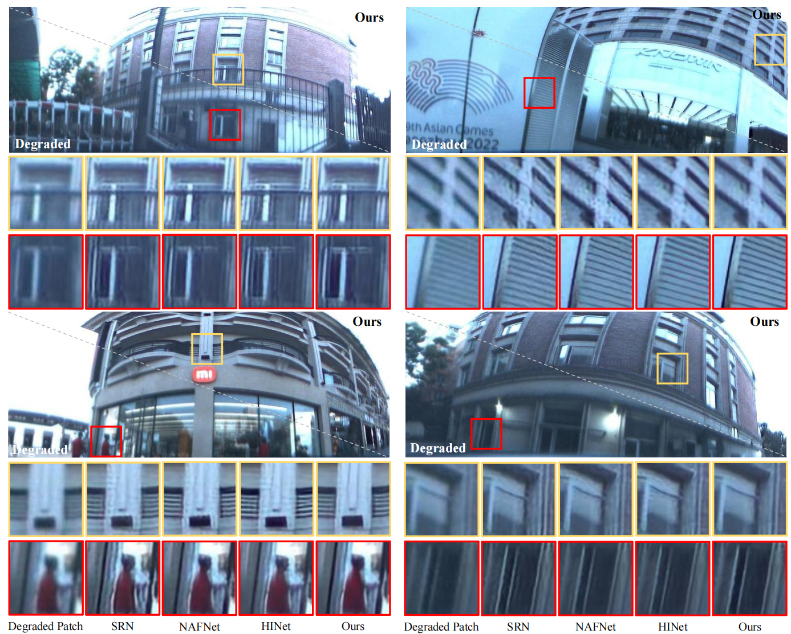

### PI2RNet-Physics Informed Image Restoration Network for Annular Computational Imaging (ACI)

> PI2RNet is used for image restoration of unfolded panoramic images taken from Panoramic Annular Lens (PAL) composed of few lenses, which is degraded by optical aberrations and unfolding process. 
---
#### Qi Jiang, Hao Shi, Lei Sun, Shaohua Gao, Kailun Yang and Kaiwei Wang
#### Paper (preprint): https://arxiv.org/abs/2206.06070
#### Our paper is accepted and will be published by IEEE Transactions on Computational Imaging. 


### Introduction of our work: We design a framework to capture clear panoramic images through simple lens.

We simulate the imaging process of PAL and create the synthetic dataset, i.e. the DIVPano dataset, for training our network. The trained network can correct the optical aberrations of simple PAL system and produce clear panoramic images. The proposed Annular Computational Imaging (ACI) framework is shown below. 

We design the PI2RNet for processing the images degraded by spatial-variant PSFs of optical aberrations, where the physical priors of optical system are applied through Dynamic Deformable Convolution (D2Conv) and Physics-informed Bridge (PiB). The idea of single-pass physics-informed engine is adopted for modeling the physical process of imaging. The architecture of PI2RNet is shown below.


### Installation

The implementation of our work is based on [BasicSR](https://github.com/xinntao/BasicSR), which is an open source toolbox for image/video restoration tasks. 

```
python 3.8.15
pytorch 1.8.1
cuda 11.1
```

```
conda create -n ACI python=3.8
conda activate ACI
pip install torch==1.8.1+cu111 torchvision==0.9.1+cu111 torchaudio==0.8.1 -f https://download.pytorch.org/whl/torch_stable.html
pip install -r requirements.txt
python setup.py develop --no_cuda_ext
```

### Quick Start (Demo for a single unfolded PAL image)
---
```
python basicsr/demo.py -opt options/demo/demo.yml
```
The input image and related physical information can be found in ./demo/Input while the restored results will be generated in ./demo/Output.

### Training and Testing PI2RNet
---
* prepare data
  * We have simulated the degraded imaging results of our chosen PAL system and produce the DIVPano datasets. As a novel model for restoration of aberration images, PI2RNet can also be applied for other optical lenses with different aberrations distributions. If you want to use PI2RNet for other optical systems, the physical information and datasets should be re-constructed based on simulation pipeline. We welcome readers who are interested in the simulation pipeline to discuss with us, but the related codes are not available here.
  * If you want to use DIVPano for experiments, please contact us for the access to it.


* eval
  * ```python basicsr/test.py -opt options/test/DIVPano/PI2RNet.yml ```
  
* train

  * ```python basicsr/train.py -opt options/train/DIVPano/PI2RNet.yml```


### Results

---
PI2RNet has set new state of the art in image restoration of unfolded PAL images both quantitatively and qualitatively.


<div align="center">

</div>



### License

This project is under the MIT license, and it is based on [BasicSR](https://github.com/xinntao/BasicSR) which is under the Apache 2.0 license.

### Citations

If ACI-PI2RNet helps your research or work, please consider citing ACI-PI2RNet.
```
@article{jiang2022annular,
  title={Annular computational imaging: Capture clear panoramic images through simple lens},
  author={Jiang, Qi and Shi, Hao and Sun, Lei and Gao, Shaohua and Yang, Kailun and Wang, Kaiwei},
  journal={arXiv preprint arXiv:2206.06070},
  year={2022}
}
```

### Contact
If you have any questions, please contact qijiang@zju.edu.cn.
